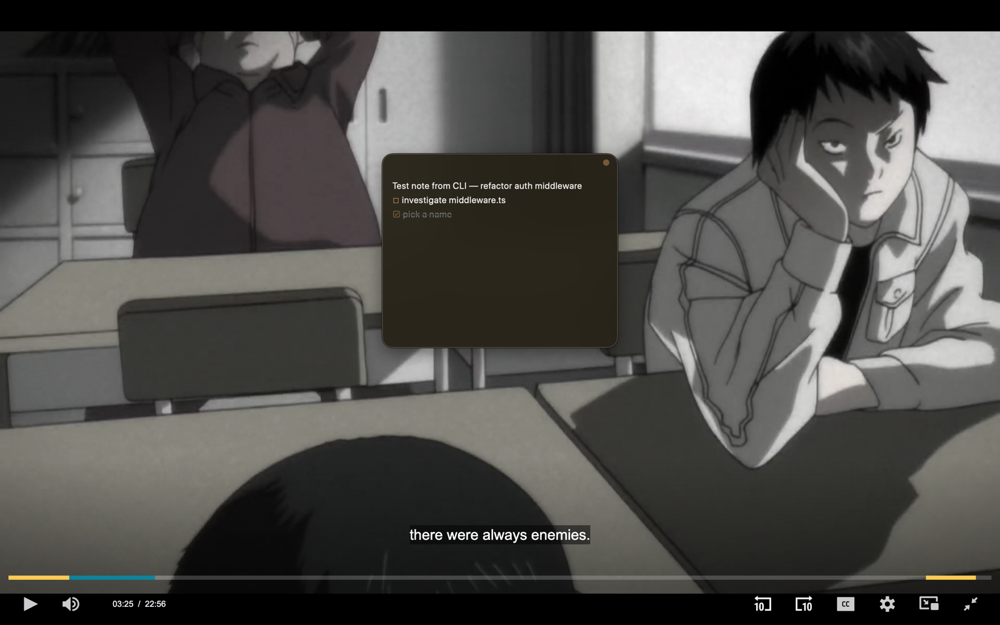
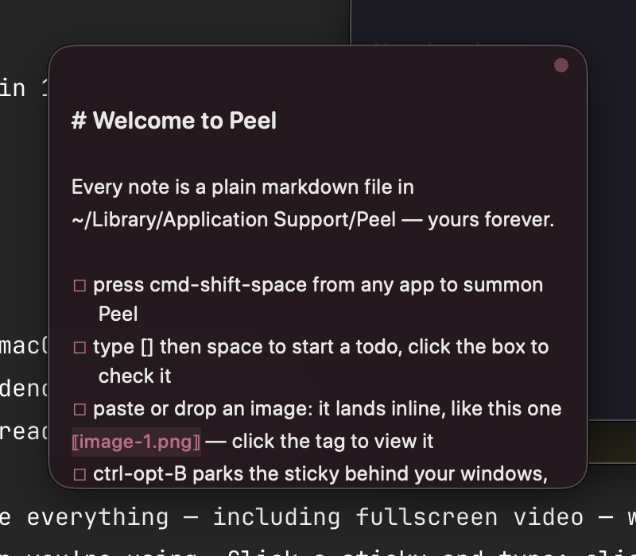
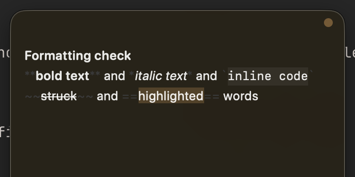
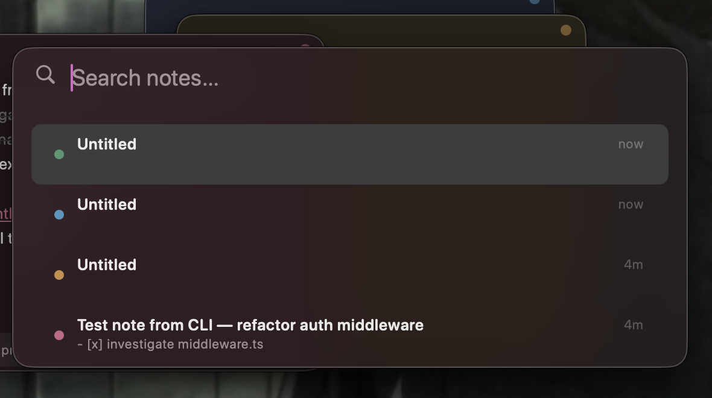
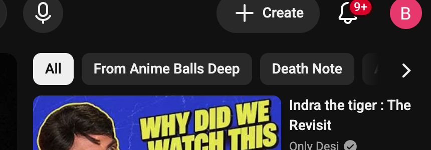

<p align="center">
  
</p>

<h1 align="center">Peel</h1>

<p align="center"><b>Sticky notes that float over everything. Even fullscreen video.</b><br>
Native AppKit, one ~600 KB binary, zero dependencies, zero network. Your notes are just markdown files.</p>

<p align="center">
  <a href="https://github.com/Adarsha23/peel/actions/workflows/ci.yml"></a>
  
  
  
  
  
</p>

<p align="center">
  
</p>

## the itch

You're watching something fullscreen. A thought shows up. Your options today: pause
and open Notes like a caveman, scribble on paper, or pay a subscription for an
app that still pauses your video when you click it.

Hell nah. Press `⌘⇧Space`. A sticky appears over the video. Type the thought.
Click back into the video, it never stopped playing, and the sticky stays. That
one interaction is the whole reason Peel exists. Everything else grew around it.

## what you get

- **True fullscreen overlay.** The sticky is a non-activating panel: it takes
  your keystrokes when you click it and gives them back when you leave. The app
  underneath never loses fullscreen, focus, or playback.
- **Reminders that actually reach you.** Peel fires its own floating reminder
  card with a chime. It ignores Do Not Disturb, shows up over fullscreen, and
  waits until you deal with it. Fires while you're at lunch? Still there when
  you're back. (System notifications stay on as the fallback for when the app
  isn't running.)
- **Screenshots you can search.** Every image you paste gets OCR'd on-device
  with Apple Vision. `peel search "that error"` finds the note whose screenshot
  contains those words. Nothing leaves your Mac.
- **Notes are files, forever.** Plain markdown with readable frontmatter,
  auto-committed to a local git repo every 6 hours. Claude Code reads and
  writes them out of the box (a bundled skill teaches it the format).
- **An idle sticky gets out of your way.** Leave it alone for a few seconds and
  it fades translucent so you can read what's underneath. Touch it, it's back.

| | |
| --- | --- |
|  |  |
| Screenshots land inline, exactly where you dropped them | Live markdown. Plain text on disk, styled in the editor |
|  |  |
| Search notes, filenames, and the text inside screenshots | Reminder cards in the note's color. They wait for you |

Plus: a shelf of note tabs when you push your cursor to the screen edge (hover
a tab for a browser-style ✕), `[[note links]]` between stickies, an inline
calculator (`240*1.18=` and the answer appears), a `/` command menu, snap
alignment while dragging, seven muted paper colors, per-note text zoom, and a
real CLI.

## install

```bash
git clone https://github.com/Adarsha23/peel && cd peel
make install    # builds, signs, drops Peel.app in ~/Applications, links the peel CLI
peel            # aite, you're in
```

Want it always around? Menu bar icon, "Start at Login". Done.

## drive it

**Global, works from any app:**

| key | what happens |
| --- | --- |
| `⌘⇧Space` | summon the latest sticky / focus it / press again to tuck everything away |
| `⌃⌥V` | whatever's on your clipboard becomes a new sticky (text, image, files) |
| cursor to bottom edge | the shelf: every note as a tab, click to open, hover for ✕ |

**Inside a sticky** (your other apps never see these):

| key | what happens |
| --- | --- |
| `esc` / `⌘W` | hide it |
| `⌘esc` | hide all of them |
| `⌘T` / `⌃⌥N` | new sticky |
| `⌘↩` | toggle the todo on this line (or just click the box) |
| `⌘B` `⌘I` `⌘E` | bold, italic, code |
| `⌘⇧X` `⌘⇧H` | strikethrough, highlight |
| `⌘+` `⌘−` `⌘0` | text zoom per sticky |
| `⌃⌥F` | search |
| `⌃⌥B` | park the sticky behind your windows / bring it back |
| `⌃⌥S` | screenshot straight into the note |
| `⌃⌥A` | archive |
| `⌃⌥1..7` | recolor |

Type `/` on an empty line for the command menu, or `/help` for the full
cheatsheet in-app. Typing tricks: `[]` + space starts a todo, `-` + space a
bullet, ``` fences make a code block, `[[` links to another note, and
`240*1.18=` does the math for you.

## reminders, the way they should work

Type `/remind`, pick a time from the menu, type what to remember over the
selected placeholder. Or write it by hand, Peel reads natural language:

```
@remind tomorrow 9am call the bank
@remind Sep 20, 2:30 PM check the oven
/remind in 20 min pay rent
```

Live feedback while you type: the time gets underlined in orange when Peel
understood it, the tag turns red when it didn't (hover it for why). Click any
`@remind` tag to pick or change the time from a menu.

At fire time you get Peel's own floating card: chime, the note's color,
Open Note / Snooze 10 min / Done. It doesn't expire and it doesn't care about
Do Not Disturb. If reminders ever act up, `peel doctor` tells you exactly
what's wrong with the system-notification fallback path.

## terminal

```bash
peel new "thought"      # new sticky, right now
peel list               # what you've got
peel search "auth"      # full text, includes archived notes and OCR'd screenshots
peel today              # everything you touched today, as markdown
peel show <id>          # one note plus its attachments
peel archive <id>       # tuck it away (nothing is ever deleted)
peel ui shelf           # poke the running app: toggle|new|search|show-all|hide-all|help|clip|shelf
peel doctor             # reminders acting up? receipts here
```

## where your stuff lives

```
~/Library/Application Support/Peel/
    notes/20260914-190456-gvbj.md      # frontmatter (color, frame, state) + markdown
    attachments/<note-id>/             # images and files, OCR sidecars in .ocr/
    archive/                           # archived notes, kept forever
    config.json                        # hotkeys and knobs
```

Point `PEEL_DATA_DIR` somewhere else if you want (an iCloud Drive folder gets
you sync with zero servers). Deleted attachments go to the Trash, not the
void. A corrupted note file loads as plain text instead of crashing anything.

## claude code

`make install` also drops a `peel-notes` skill into `~/.claude/skills/`, so
Claude Code knows where your notes live, how to resolve the inline screenshot
references (in the order you placed them), how to grep the OCR sidecars, and
how to pop a note onto your screen with `peel new` when it finishes a job.
Tell it "look at my sticky notes from today" and it just works.

## how it's built

- `Sources/PeelKit`: the brain, no AppKit. Note model, frontmatter parsing,
  markdown-to-editor mapping, file store, search, OCR, calculator, CLI. This
  is where the unit tests live.
- `Sources/Peel`: the body. Non-activating floating panels
  (`.canJoinAllSpaces` + `.fullScreenAuxiliary` is the fullscreen trick),
  Carbon global hotkey (no accessibility permission needed), menu bar, shelf,
  search palette, reminder engine, directory watcher.
- One binary is both the app and the CLI. `make app` wraps it in a bundle.

```bash
make run        # run from source
make test       # unit tests
make install    # the whole thing
```

## honest limitations

- macOS only. The overlay trick is native AppKit and that's the point.
  The notes format is portable markdown, so your data isn't locked anywhere.
- Ad-hoc signed for personal use. Runs fine on your Mac, not distributable
  to others as-is.
- Over a fullscreen app, macOS shows floating panels only while that Space is
  active. True for every overlay utility ever written.
- "Push behind windows" can't push behind a fullscreen app, because nothing
  can. Use esc there instead.

MIT. Built by one person who was tired of pausing videos.
