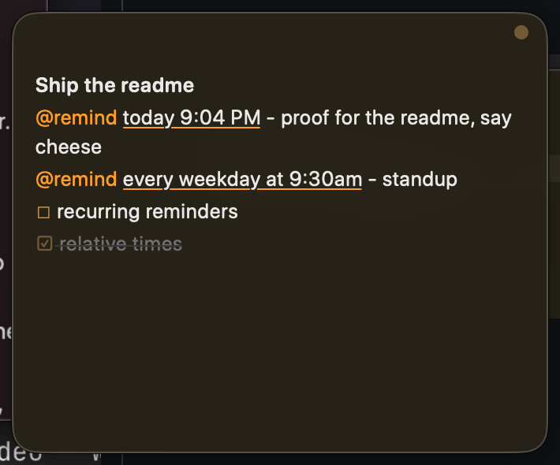
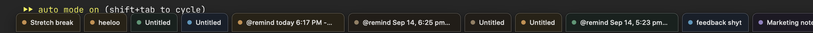
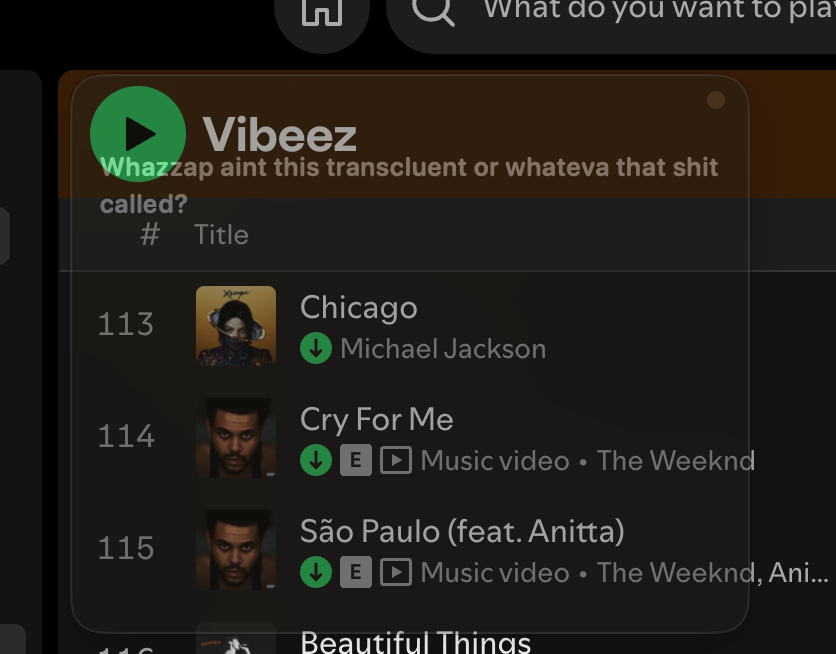

<p align="center">
  
</p>

<h1 align="center">Peel</h1>

<p align="center"><b>Sticky notes that float over everything. Even fullscreen video.</b><br>
Native AppKit, one ~600 KB binary, zero dependencies, zero network. Your notes are just markdown files.</p>

<p align="center">
  <a href="https://github.com/Adarsha23/peel/actions/workflows/ci.yml"></a>
  
  
  
  
  
</p>

<p align="center">
  
</p>

## the itch

You're watching something fullscreen. A thought shows up. Your options today: pause
and open Notes like a caveman, scribble on paper, or pay a subscription for an
app that still pauses your video when you click it.

Hell nah. Press `⌘⇧Space`. A sticky appears over the video. Type the thought.
Click back into the video, it never stopped playing, and the sticky stays. That
one interaction is the whole reason Peel exists. Everything else grew around it.

## what you get

- **True fullscreen overlay.** The sticky is a non-activating panel: it takes
  your keystrokes when you click it and gives them back when you leave. The app
  underneath never loses fullscreen, focus, or playback.
- **Reminders that actually reach you.** Peel fires its own floating reminder
  card with a chime. It ignores Do Not Disturb, shows up over fullscreen, and
  waits until you deal with it. Fires while you're at lunch? Still there when
  you're back. (System notifications stay on as the fallback for when the app
  isn't running.)
- **Screenshots you can search.** Every image you paste gets OCR'd on-device
  with Apple Vision. `peel search "that error"` finds the note whose screenshot
  contains those words. Nothing leaves your Mac.
- **Notes are files, forever.** Plain markdown with readable frontmatter,
  auto-committed to a local git repo every 6 hours. Claude Code reads and
  writes them out of the box (a bundled skill teaches it the format).
- **An idle sticky gets out of your way.** Leave it alone for a few seconds and
  it fades translucent so you can read what's underneath. Touch it, it's back.

| | |
| --- | --- |
|  |  |
| Screenshots land inline, exactly where you dropped them | Live markdown. Plain text on disk, styled in the editor |
|  |  |
| Type a time, Peel underlines what it understood | ...and at 9:04 it fired. The card waits until you deal with it |

<p align="center"><br>
<sub>The shelf. Cursor to the screen edge, every note shows up as a tab. Click to open, hover for a browser-style close.</sub></p>

<p align="center"><br>
<sub>Leave a sticky alone and it goes translucent (yes, that's what it's called) so what's underneath stays readable. Touch it, it's back.</sub></p>

<p align="center"><br>
<sub>Search over note text, filenames, and the words inside your screenshots.</sub></p>

## every damn feature

Some apps list five features because they have five. This list is long because
the app does a lot, and all of it is free and local.

**Catch the thought before it dies**
- `⌘⇧Space` from anywhere: latest sticky, focused, cursor ready. Press again to clear the desk
- `⌃⌥V`: whatever's on the clipboard becomes a sticky. Text, screenshot, files, whatever
- `peel new "thing"` from the terminal, and the sticky pops on screen
- everything autosaves 400 ms after you stop typing. There is no save button. Kill the app, kill the Mac, your note survives

**The overlay nobody else ships**
- floats over fullscreen video and the video keeps playing. Click the sticky, type, click back. Zero interruptions
- non-activating panels: Peel never steals your app's focus, never switches your menu bar
- lives on every Space, remembers its exact position and size per monitor, across restarts
- `⌃⌥B` parks a sticky behind your windows; bring it back the same way
- idle stickies fade to 40% so you can read what's under them. Touch brings them back. Optional auto-tuck to the shelf
- drag one near another and the edges snap. Slow drags magnetize, fast drags fly free

**The shelf**
- push the cursor into a screen edge: every note as a color-coded tab, first line as the label
- pick your edge (bottom, top, left, right) from the menu bar. Vertical edges get a column
- click a tab and the sticky expands out of it, dock-style. Hover for ✕, or hit `✕ all`

**Writing that stays honest**
- what's on disk is what you see: markdown source, styled live. No rich-text lock-in, ever
- `**bold**` `*italic*` `` `code` `` `~~strike~~` `==highlight==` `#` headings, markers dimmed in place
- `[]` + space makes a todo, click the box or `⌘↩` to check it. Enter continues lists, bullets, numbering
- code fences go monospaced, URLs are clickable, first line renders as the note's title
- `240*1.18=` and the answer appears. Real parser, division by zero does nothing embarrassing
- `[[note title]]` links between stickies. Type `[[` and your titles autocomplete. Link to a note that doesn't exist and clicking it creates one
- `⌘+` `⌘−` per-sticky text zoom, seven muted paper colors on `⌃⌥1..7`, paste is always plain text
- `/` on an empty line opens the command menu: type to filter, click to run. `/count` `/trim` `/lower` `/upper` `/date` `/time` `/copy` and friends

**Images and files**
- paste or drop an image: saved locally, referenced inline right where your cursor was, as a clickable tag
- delete the tag and the file isn't gone, it falls back to the attachment strip
- `⌃⌥S` takes a screenshot straight into the note (the sticky hides itself so it's not in your shot)
- every image is OCR'd on-device. Search finds notes by the text inside their screenshots
- non-image files get chips: click to open, right-click to reveal, copy path, or trash. 100 MB+ files get symlinked, not copied

**Reminders that actually fire**
- `@remind in 20 min pay rent`. `@remind tomorrow 9am call bank`. `@remind every weekday at 9:30 standup`. `@remind every weekend 10am touch grass`
- relative, absolute, and recurring, parsed by a deterministic grammar with tests, not vibes
- live feedback while typing: understood time gets underlined orange, red means try again, tooltip shows exactly what's armed
- `/remind` picks from a menu, click any @remind tag to change its time
- at fire time: Peel's own floating card in the note's color, with a synthesized two-note chime. Works over fullscreen, ignores Do Not Disturb, survives your screensaver, and waits until you hit Open, Snooze, or Done
- system notifications stay on as the fallback for when the app isn't running. `peel doctor` diagnoses that whole pipeline when macOS acts up

**Find anything**
- `⌃⌥F`: Spotlight-style palette, live results, arrow keys, enter to jump. Recent notes when the query's empty
- searches bodies, attachment names, and OCR'd screenshot text. CLI search includes archived notes too

**Your data, your rules**
- plain markdown files with readable frontmatter in one transparent folder
- auto-committed to a local git repo at launch and every 6 hours. Nothing is ever lost, nothing ever leaves your Mac
- archive instead of delete, attachments trash instead of vanish, corrupt files load as plain text instead of crashing
- `PEEL_DATA_DIR` moves the whole thing (point it at iCloud Drive for zero-server sync)
- remap every shortcut, hotkey, and the shelf edge in `config.json`. The JSON is the settings UI

**Claude Code, first-class**
- `make install` drops a skill that teaches Claude where notes live, how to read your screenshots in the order you placed them, and how to pop results onto your screen with `peel new`
- edit a note file from anywhere (Claude, vim, a script) and the open sticky updates within 2 seconds

**The little things**
- double-click a header to collapse a sticky to its title line
- `⌘⌫` deletes to line start and keeps eating upward on repeat
- menu bar home with Start at Login, screenshot capture, and every toggle
- light and dark palettes designed separately, not inverted
- the whole app is one ~600 KB binary with zero dependencies. Launches before you finish blinking

## install

```bash
git clone https://github.com/Adarsha23/peel && cd peel
make install    # builds, signs, drops Peel.app in ~/Applications, links the peel CLI
peel            # aite, you're in
```

Want it always around? Menu bar icon, "Start at Login". Done.

## drive it

**Global, works from any app:**

| key | what happens |
| --- | --- |
| `⌘⇧Space` | summon the latest sticky / focus it / press again to tuck everything away |
| `⌃⌥V` | whatever's on your clipboard becomes a new sticky (text, image, files) |
| cursor to bottom edge | the shelf: every note as a tab, click to open, hover for ✕ |

**Inside a sticky** (your other apps never see these):

| key | what happens |
| --- | --- |
| `esc` / `⌘W` | hide it |
| `⌘esc` | hide all of them |
| `⌘T` / `⌃⌥N` | new sticky |
| `⌘↩` | toggle the todo on this line (or just click the box) |
| `⌘B` `⌘I` `⌘E` | bold, italic, code |
| `⌘⇧X` `⌘⇧H` | strikethrough, highlight |
| `⌘+` `⌘−` `⌘0` | text zoom per sticky |
| `⌃⌥F` | search |
| `⌃⌥B` | park the sticky behind your windows / bring it back |
| `⌃⌥S` | screenshot straight into the note |
| `⌃⌥A` | archive |
| `⌃⌥1..7` | recolor |

Every one of those is remappable: `"keys": {"hide": "cmd+shift+w", "bold": "none"}`
in config.json, pipe for multiple chords. The shelf edge is configurable too
(`"shelfEdge": "left"`, or pick it in the menu bar).

Type `/` on an empty line for the command menu, or `/help` for the full
cheatsheet in-app. Typing tricks: `[]` + space starts a todo, `-` + space a
bullet, ``` fences make a code block, `[[` links to another note, and
`240*1.18=` does the math for you.

## reminders, the way they should work

Type `/remind`, pick a time from the menu, type what to remember over the
selected placeholder. Or write it by hand, Peel reads natural language:

```
@remind in 20 min pay rent
@remind tomorrow 9am call the bank
@remind every weekday at 9:30am standup
@remind every weekend 10am touch grass
@remind Sep 20, 2:30 PM check the oven
```

Recurring ones re-arm themselves after every fire. Hours 1 to 7 with no am/pm
mean afternoon, because nobody sets a 3am reminder on purpose.

Live feedback while you type: the time gets underlined in orange when Peel
understood it, the tag turns red when it didn't (hover it for why). Click any
`@remind` tag to pick or change the time from a menu.

At fire time you get Peel's own floating card: chime, the note's color,
Open Note / Snooze 10 min / Done. It doesn't expire and it doesn't care about
Do Not Disturb. If reminders ever act up, `peel doctor` tells you exactly
what's wrong with the system-notification fallback path.

## terminal

```bash
peel new "thought"      # new sticky, right now
peel list               # what you've got
peel search "auth"      # full text, includes archived notes and OCR'd screenshots
peel today              # everything you touched today, as markdown
peel show <id>          # one note plus its attachments
peel archive <id>       # tuck it away (nothing is ever deleted)
peel ui shelf           # poke the running app: toggle|new|search|show-all|hide-all|help|clip|shelf
peel doctor             # reminders acting up? receipts here
```

## where your stuff lives

```
~/Library/Application Support/Peel/
    notes/20260914-190456-gvbj.md      # frontmatter (color, frame, state) + markdown
    attachments/<note-id>/             # images and files, OCR sidecars in .ocr/
    archive/                           # archived notes, kept forever
    config.json                        # hotkeys and knobs
```

Point `PEEL_DATA_DIR` somewhere else if you want (an iCloud Drive folder gets
you sync with zero servers). Deleted attachments go to the Trash, not the
void. A corrupted note file loads as plain text instead of crashing anything.

## claude code

`make install` also drops a `peel-notes` skill into `~/.claude/skills/`, so
Claude Code knows where your notes live, how to resolve the inline screenshot
references (in the order you placed them), how to grep the OCR sidecars, and
how to pop a note onto your screen with `peel new` when it finishes a job.
Tell it "look at my sticky notes from today" and it just works.

## how it's built

- `Sources/PeelKit`: the brain, no AppKit. Note model, frontmatter parsing,
  markdown-to-editor mapping, file store, search, OCR, calculator, CLI. This
  is where the unit tests live.
- `Sources/Peel`: the body. Non-activating floating panels
  (`.canJoinAllSpaces` + `.fullScreenAuxiliary` is the fullscreen trick),
  Carbon global hotkey (no accessibility permission needed), menu bar, shelf,
  search palette, reminder engine, directory watcher.
- One binary is both the app and the CLI. `make app` wraps it in a bundle.

```bash
make run        # run from source
make test       # unit tests
make install    # the whole thing
```

## honest limitations

- macOS only. The overlay trick is native AppKit and that's the point.
  The notes format is portable markdown, so your data isn't locked anywhere.
- Ad-hoc signed for personal use. Runs fine on your Mac, not distributable
  to others as-is.
- Over a fullscreen app, macOS shows floating panels only while that Space is
  active. True for every overlay utility ever written.
- "Push behind windows" can't push behind a fullscreen app, because nothing
  can. Use esc there instead.

MIT. Built by one person who was tired of pausing videos.
